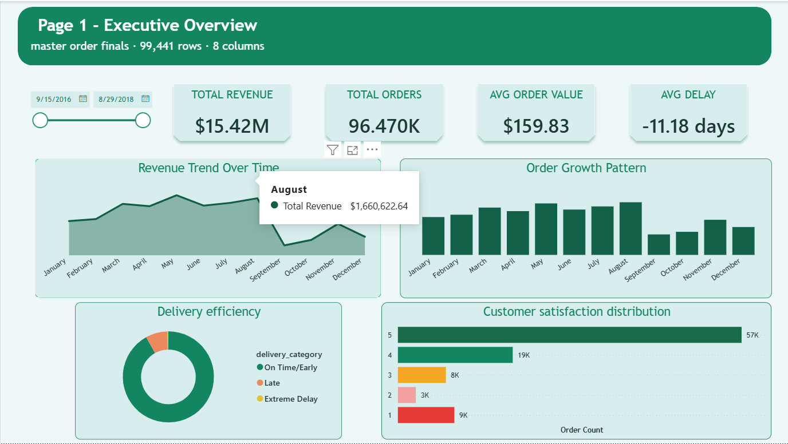

# Olist SQL + Power BI Project

This repository contains my end-to-end work on the Olist e-commerce dataset:

- Data preparation from source CSV files
- SQL modeling and transformation scripts
- Cleaned output tables for reporting
- Power BI dashboard development

## Project Workflow

1. Load source data from the `data` folder.
2. Build and clean tables using SQL scripts in `sql_querys`.
3. Export analysis-ready tables to `cleaned_data`.
4. Use cleaned outputs in Power BI to build dashboards.

## Repository Structure

| Path | Description |
|---|---|
| `data/` | Raw Olist dataset CSV files used as source input |
| `sql_querys/` | SQL scripts for table creation, joins, cleaning, and performance analysis |
| `cleaned_data/` | Final cleaned CSV outputs used in Power BI |
| `screenshots/` | Dashboard screenshots for README and project documentation |
| `tosql.ipynb` | Notebook used during SQL/data preparation workflow |

## Source Data Files

| File | Rows | Purpose |
|---|---:|---|
| `olist_orders_dataset.csv` | 99,441 | Order lifecycle and delivery timestamps |
| `olist_order_items_dataset.csv` | 112,650 | Item-level sales, seller, and freight details |
| `olist_order_payments_dataset.csv` | 103,886 | Payment method, installments, and payment values |
| `olist_order_reviews_dataset.csv` | 104,164 | Review score and review timestamps |
| `olist_customers_dataset.csv` | 99,441 | Customer identity and location linkage |
| `olist_sellers_dataset.csv` | 3,095 | Seller identity and location |
| `olist_products_dataset.csv` | 32,951 | Product attributes and category details |

## SQL Work Completed

The SQL scripts currently included in this project:

- `master_db.sql`, `master_db2.sql`, `master_db3.sql`: master table building and modeling steps
- `main_table(order).sql`: order-level main table logic
- `clean_table.sql`: cleaning and transformation logic
- `Other_tables.sql`: supporting table creation queries
- `prod_perf.sql`: product performance analysis queries
- `seller.sql`: seller performance analysis queries

## Cleaned Outputs for BI

These output files are currently available and used for reporting:

- `cleaned_data/master_order_finals.csv`
- `cleaned_data/product_performance.csv`
- `cleaned_data/seller_performances.csv`

## Power BI Dashboard

I am currently building a Power BI dashboard from the cleaned tables above.

### Planned Dashboard Pages

- Executive summary
- Sales and order trends
- Product performance
- Seller performance

### Dashboard Screenshots

### Executive Summary

### Customer and retention analysis

### Product Performance

### Seller Performance

## Next Update

When dashboard development is complete, this README will be updated with:

- Final KPI list
- Dashboard insights summary
- Embedded Power BI report link (if published)