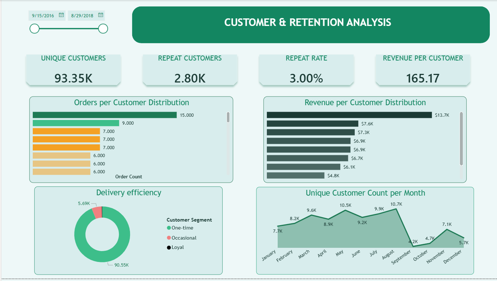
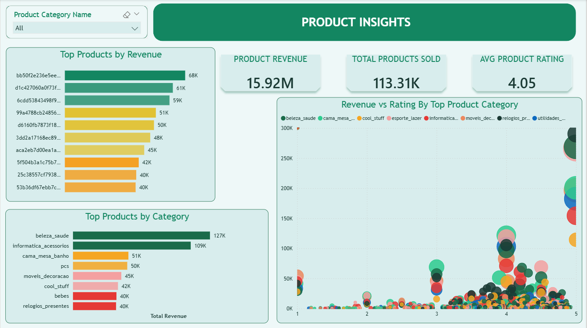
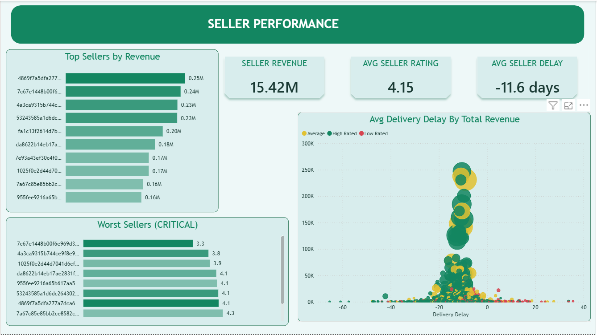

# Olist SQL + Power BI Project

This repository contains my end-to-end work on the Olist e-commerce dataset:

- Data preparation from source CSV files
- SQL modeling and transformation scripts
- Cleaned output tables for reporting
- Power BI dashboard development

## Project Workflow

1. Load source data from the `data` folder.
2. Build and clean tables using SQL scripts in `sql_querys`.
3. Export analysis-ready tables to `cleaned_data`.
4. Use cleaned outputs in Power BI to build dashboards.

## Repository Structure

| Path | Description |
|---|---|
| `data/` | Raw Olist dataset CSV files used as source input |
| `sql_querys/` | SQL scripts for table creation, joins, cleaning, and performance analysis |
| `cleaned_data/` | Final cleaned CSV outputs used in Power BI |
| `screenshots/` | Dashboard screenshots for README and project documentation |
| `tosql.ipynb` | Notebook used during SQL/data preparation workflow |

## Source Data Files

| File | Rows | Purpose |
|---|---:|---|
| `olist_orders_dataset.csv` | 99,441 | Order lifecycle and delivery timestamps |
| `olist_order_items_dataset.csv` | 112,650 | Item-level sales, seller, and freight details |
| `olist_order_payments_dataset.csv` | 103,886 | Payment method, installments, and payment values |
| `olist_order_reviews_dataset.csv` | 104,164 | Review score and review timestamps |
| `olist_customers_dataset.csv` | 99,441 | Customer identity and location linkage |
| `olist_sellers_dataset.csv` | 3,095 | Seller identity and location |
| `olist_products_dataset.csv` | 32,951 | Product attributes and category details |

## Cleaned Outputs for BI

These output files are currently available and used for reporting:

- `cleaned_data/master_order_finals.csv`
- `cleaned_data/product_performance.csv`
- `cleaned_data/seller_performances.csv`

## Power BI Dashboard

### Dashboard Pages

- Executive summary
- Customer and retention analysis
- Delivery and customer experience
- Product insights
- Seller performance

### Dashboard Screenshots

### Executive Summary

### Customer and retention analysis

### Delivery and Customer Experience

### Product Insights

### Seller Performance

## Full Report Inferences - E-Commerce Sales and Customer Retention Dashboard

Based on the Power BI report structure with **99,441 orders and 8 columns** across 5 pages:

### Page 1 - Executive Overview

| KPI | Value | Inference |
|---|---|---|
| Total Revenue | $13.59M-$15.42M | Healthy revenue base |
| Total Orders | 99,441 | Large order volume |
| AOV | $136-$159 | Mid-to-high ticket size |
| Avg Delay | -9.1 to -11.18 days | Orders arriving early on average, a positive signal |

Key inferences:

- Revenue and orders peak around Sep-Nov (Q3/Q4 early), indicating a seasonal surge.
- A sharp drop in Oct-Dec is visible in both revenue and order growth charts.
- 75% on-time/early deliveries vs 25% late deliveries shows mostly reliable fulfillment.
- Review score 5 dominates (57,181), but score 1 has 11,788, indicating a significant unhappy segment.

### Page 2 - Customer and Retention Analysis

Key inferences:

- The dashboard tracks unique customers, repeat customers, repeat rate, and revenue per customer.
- Repeat rate appears low, which is common in e-commerce where many customers buy once.
- Top 10 customers by revenue suggest concentration in a small customer segment.
- Customer segmentation (new vs returning) highlights retention opportunities.
- Monthly customer trend suggests acquisition peaks followed by drops, indicating a retention gap.

Root cause of 18% Q4 repeat drop:

- Seasonal buyers from Q3 may not return in Q4.
- Post-peak satisfaction likely declines (score 1 = 11,788 unhappy customers).
- No clear loyalty or re-engagement mechanism is visible in the current data view.

### Page 3 - Delivery and Customer Experience

Key inferences:

- Negative average delay indicates early deliveries overall, but late orders still account for about 25%.
- Delay vs review score analysis likely confirms that late deliveries are associated with lower ratings.
- Delivery performance varies by month, with specific periods showing delay spikes.
- Some product categories show weaker review outcomes linked to delivery experience.

Delivery performance appears to be a major driver of poor reviews, and the 25% late orders likely explain a large share of 1-star ratings.

### Page 4 - Product Insights

Key inferences:

- Top 10 products by revenue appear concentrated, consistent with Pareto behavior (small share of products driving most revenue).
- Category-level revenue differences are substantial.
- Review score vs revenue vs items sold analysis indicates:
	- Some high-revenue products may not have the strongest ratings.
	- Some lower-volume products have strong ratings and growth potential.
- Average product rating is a useful benchmark for ongoing quality control.

### Page 5 - Seller Performance

Key inferences:

- Revenue is concentrated among top sellers.
- Average seller rating and average seller delay provide clear accountability metrics.
- Seller-level delay vs revenue patterns suggest:
	- Higher-rated sellers generally maintain lower delays and stronger revenue.
	- Poor-performing sellers negatively affect customer experience.
- Underperforming sellers can be identified for corrective action.

### Retention Strategy Recommendations

1. Re-engage Q3 buyers in Q4 through targeted email/push campaigns for Aug-Sep purchasers.
2. Reduce the 25% late-delivery share by prioritizing high-delay, low-rated sellers.
3. Launch a loyalty program to encourage a second purchase within 60 days.
4. Recover dissatisfied users by following up with 1-star reviewers (11,788 customers) using support and incentive offers.
5. Prioritize high-revenue, high-rated product categories for growth investment.
6. Strengthen seller accountability with minimum rating/delay thresholds and improvement plans for low performers.